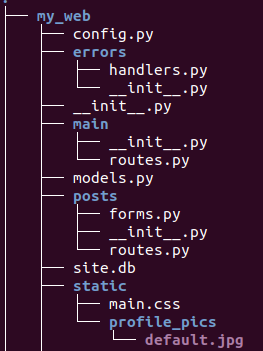
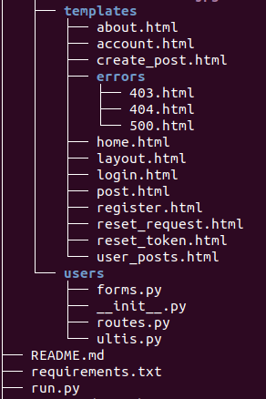

# [APP] Web Blog
1. [Tree dir](#Tree-dir)
2. [Module](#Module)

---
### Tree dir

 
---
### Module
1. Errors (Errors dir)
    * Xử lý các lỗi 403, 404, 500.
    * Các function **error_403, error_404 và error_500** (trong file *handlers.py*) lần lượt render đến các trang **403.html, 404.html** và **500.html**.
2. Main (Main dir)
    * (*file routes.py*) gồm 2 route **home** và **about** render đến **home.html** và **about.html**.
    * Route **home**: quản lý pagination.
    * Route **abou**: Đợi Update chưa biết ghi gì :p hoặc có thể bỏ luôn thay bằng cái khác.
3. Posts (Posts dir)
    * (*file forms.py*) quản lý class PostForm gồm 2 thuộc tính **title** và **content**.
    * (*file routes.py*) quản lý các route **new_post, id_post, update_post** và **delete_post**.
        + new_post (**/post/new**):
            - Nhận PostForm.
            - Khi submit Post:
                - Đúng: Hàm sẽ add *title* và *content* của bài Post vào database. return route *home* của **Main**.
                - Sai: return **create_post.html** với các tham số *title, form, legend*.
        + id_post (**/post/<int:post_id>**)
            - Xem nội dung, thông tin về bài đăng. return **post.html**
        + update_post (**/post/<int:post_id>/update**):
            - Nhận vào một bài đăng.
                - Nếu tên tác giả của bài đăng khác với tên user hiện tại thì trả về **403**.
            - Nếu method là Post thì cập nhật *title* và *content* cho bài post đó trong database. return route id_post.
            - return **create_post.html**. Với các tham số *title, form, legend*.
        + delete_post (**/post/<int:post_id>/delete**):   
            - Nhận vào một bài đăng.
                - Nếu tên tác giả của bài đăng khác với tên user hiện tại thì trả về **403**.
            - Delete Post khỏi database.
            - return *home* của **Main**
4. Users (Users dir)
    * (*file forms.py*) quản lý các class RegistrationForm, LoginForm, UpdateAccountForm, RequestResetForm, ResetPasswordForm.
        + RegistrationForm:
            - Gồm các thuộc tính: username, email, password, confirm_password.
            - Hai chức năng: validate_username, validate_mail.
        + LoginForm: 
            - Gồm các thuộc tính: email, password, remember.
        + UpdateAccountForm:
            - Gồm các thuộc tính: username, email, picture.
            - Hai chức năng: validate_username, validate_mail.
        + RequestResetForm:
            - Thuộc tính: email.
            - Chức năng: validate_mail.
        + ResetPasswordForm:
            - Gồm các thuộc tính: password, confirm_password.
    * (*file routes.py*) quản lý các route **register, login, logout, account, username, reset_password**
        + Register:
            - Nếu user hiện tại đã xác định có trong database thì return *home* của **Main**.
            - Nếu submit form:
                + Cập nhật user, password vào database.
                + return về *login* của **Users**.
            - return **register.html** với 2 tham số *title* và *form*.
        + Login:
            - Nếu user hiện tại đã xác định có trong database thì return *home* của **Main**.
            - Nếu submit form:
                + user được gán là người đầu tiên xuất hiện sau khi filter trong database.
                + Nếu user và password vừa nhập khớp trong database:
                    - Đúng: cho phép đăng nhập. return *home* của **main**.
                    - Sai: Thông báo kiểm tra lại user và password.
                + return **login.html** với tham số *title, form*.
        + Logout:
            - Đăng xuất.
            - return *home* của **Main**
        + Account:
            - Nếu submit form:
                - Đúng: 
                    - Kiểm tra xem user có thay đổi avatar hay không.
                        - Lưu hình vào thư mục profile_pics trong static.
                        - Cập nhật hình cho User.
                    - cập nhật username, email vào database.
                    - return *account* trong **Users**.
                - Sai: 
                    - Lấy dữ liệu từ database và hiển thị user, mail.
            - Lấy hình ảnh từ thư mục profile_pics và hiển thị lên màn hình.
            - return **account.html** với các tham số *title, image_file* và *form*.
        + Username:
            - Trả về thông tin user và các bài đăng của user đó.
            - return **user_posts.html** với các tham số *posts* và *users*.
        + Reset_password:
            - Nếu user hiện tại đã cã trong database. return *home* của **main**.
            - Nếu submit form:
                + user sẽ là người đầu tiên được tìm thấy trong database.
                + gửi email tới user (email xác nhận đổi tên).
                + return *login* của **Users**.
            - return **reset_request.html** với các tham số *title* và *form*.
        + Reset_password/token:
            - Nếu user hiện tại đã cã trong database. return *home* của **main**.
            - Khi truy cập vào mail và nhận token.
            - Xác nhận token của user nếu không có => return *reset_request* của **Users**.
            - Nếu submit form:
                - Cập nhật password vào database.
                return *login* của **Users**
            - return **reset_token.html** với các tham số *title* và *form*.
    * (*file ultis.py*)            
        + Function save_picture:
            - Resize image => giảm dung lượng hình ảnh => tăng tốc độ load page.
            - lưu hình đã đưọc giảm kích thước.
        + Function send_reset_email:
            - Gửi thông báo thay đổi mật khẩu đến User.
---                   
